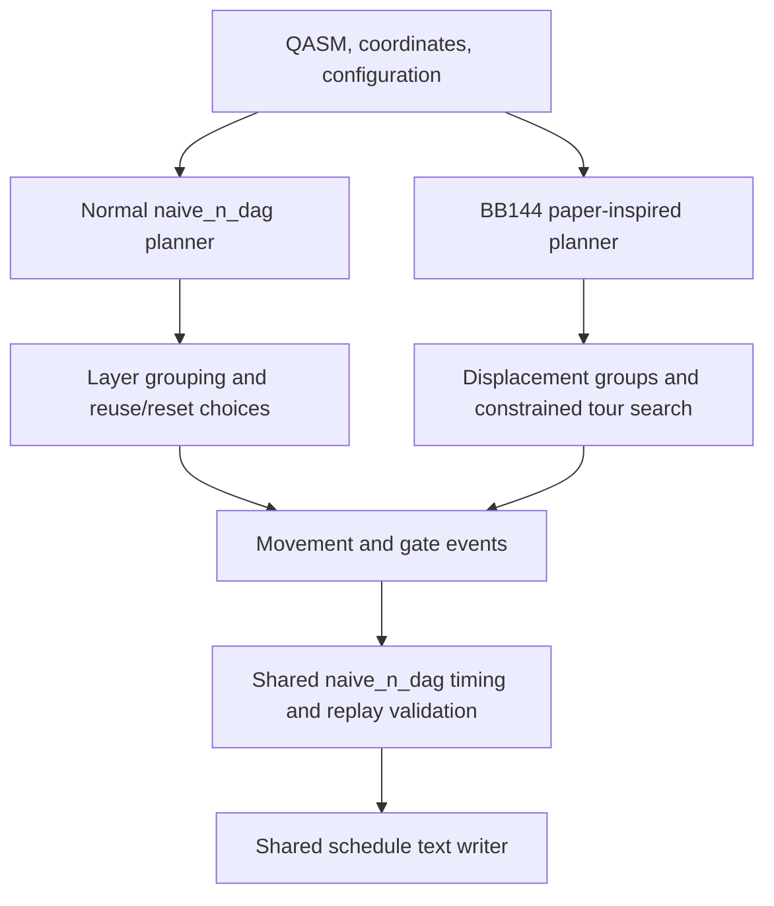

# How `bb144_paper_schedule.py` works

[bb144_paper_schedule.py](bb144_paper_schedule.py) is a separate, BB144-specific
**schedule planner that reuses the `naive_n_dag` library**. It does not call
`naive_n_dag.schedule_circuit`, and running the normal `naive_n_dag` command
does not automatically use this script.

Thus, it is separate in how it chooses movements and gate batches, but shares
the existing geometry, movement timing, replay validation, and output writer.
It is not a fully independent implementation or a modification of the normal
scheduler. No changes to `src/naive_n_dag/` were needed to generate these results.

## Where the two approaches connect



The shared functions are imported directly from the repository:

| Module | What the script uses |
| --- | --- |
| [dag_helper.py](src/naive_n_dag/dag_helper.py) | QASM-to-DAG loading, operand extraction, and gate formatting |
| [grid.py](src/naive_n_dag/grid.py) | Grid generation and placement from the supplied coordinates |
| [dynamics.py](src/naive_n_dag/dynamics.py) | Legal highway routes, movement durations, event batching, complete schedule timing, and replay validation |
| [scheduling.py](src/naive_n_dag/scheduling.py) | Single-qubit pulse packing and schedule serialization |
| [main.py](src/naive_n_dag/main.py) | Unit conversion through `_coerce_unit_config`; it does **not** invoke that module's `main()` |

Several imports begin with `_`, indicating internal helpers. Consequently,
changes to those helpers can affect or break this script. The script adds the
local `Phys765/src` directory to its import path so it uses this repository's
implementation.

## How it differs from the normal planner

The normal `schedule_circuit` evaluates four complete candidates:
`reset_only`, `reuse`, `sequential_home`, and the adapted `naive_dag` baseline.
Its layered candidates group gates using movement-vector alignment and AOD
span, then make local reuse-versus-reset decisions. It selects the fastest
valid complete candidate under the shared timer.

The paper script bypasses those candidate builders. It exploits the regular
BB144 placement: many check/data interactions have exactly the same relative
displacement, so a whole array of check atoms can visit a small collection of
interaction positions while remaining loaded.

It compares two different candidates of its own:

| Candidate | Atoms loaded together | Execution |
| --- | --- | --- |
| Separate check loads | First q[144–215], then q[216–287] | Complete and restore the X-labeled check array, then the Z-labeled array |
| Combined check load | All q[144–287] | Keep both check arrays loaded; interleave their ready interactions while preserving every input wire's gate order |

In both cases, q[0–143] remain stationary data atoms. The combined candidate
wins for the supplied input under both tested configurations. It loads once,
performs the interactions, and unloads once at the original homes.

Passing the shared validator means the emitted schedule satisfies its
geometry, rigid-load, gate-order, and restoration checks. It does **not** mean
the ordinary planner would discover or choose that schedule.

## Step-by-step through the script

### 1. Read inputs and establish homes: `main`

The script reads the JSON timing configuration, explicitly selected coordinate
file, and QASM. It converts quantities to common units and loads the circuit
as a DAG. A topological ordering preserves dependencies while allowing
independent operations to change their textual order.

The shared placement function multiplies each JSON coordinate by two to put
atoms on even-even SLM sites. A solver grid step is half `rydberg_radius`, so
this preserves the intended physical spacing. These initial positions become
the immutable `homes` used for routing and final restoration.

This script is specialized: it creates 288 atoms, recognizes the fixed data
and check ID ranges above, accepts H/Z/CZ operations, and expects 432 CZ gates
for each check type. Barriers are removed. It is not a general QASM scheduler.

### 2. Group interactions: `groups_and_precedence`

For each CZ gate, it computes

```text
offset = home[data] - home[check]
```

Gates with the same offset can execute at the same rigid displacement of the
loaded check array. Periodic boundary interactions naturally become separate
groups because they have different actual coordinate differences.

For example, offset `(36,-2)` can be served by moving the check array to
displacement `(36,-1)`: each participating check is then one column step from
its stationary data partner. The other loaded checks move too, even when they
do not participate in that CZ batch.

The function also records dependencies between groups. If a qubit encounters
a gate in group A and later one in group B, A must precede B. These
dependencies are encoded as bit masks. The combined candidate keeps the two
check types in separate groups even when their geometric offsets coincide.

### 3. Find a tour: `optimize_tour`

Each displacement group has four possible interaction positions, one for each
cardinal side of its stationary partners. The script asks the shared
`parity_route_moves` helper for a legal route between each pair of positions
and sums the shared movement-time estimates along that route.

A memoized dynamic program searches states of the form

```text
(mask of completed groups, current interaction position)
```

From each state it considers every unvisited group whose predecessors have
finished, and each of that group's four interaction sides. It chooses the
least-cost continuation, including a return to a home-adjacent position and
the final one-step unload. It also compares the four initial load directions.

This resembles a traveling-salesman problem with precedence constraints and
multiple possible positions for each stop. The paper motivated the collective
tour approach; this script implements its own dynamic program and does not
invoke the paper's Concorde solver.

“Optimal” here has a restricted meaning: minimum modeled motion within these
enumerated whole-array tours, using the shared route helper's paths and one
visit per displacement group. It does not search arbitrary load subsets,
data-atom movement, every possible grouping, or every possible physical path.
The search itself excludes gate overhead; complete candidate selection
includes gates, switches, and transfers. It therefore does not prove a global
minimum circuit completion time.

### 4. Convert the tour into events: `emit_phase` and `emit_combined`

`emit_phase` emits a movement for every atom in one check array whenever the
tour moves, and a CZ batch whenever it reaches an interaction stop.

`emit_combined` does the same for all 144 checks. It additionally keeps a cursor
into each qubit's original operation sequence. `mark_done` checks that a gate
is next on every operand's wire. `flush_singles` emits ready H/Z gates before
later interactions need them, preserving the input sequence. Independent
operations can interleave, but gates on the same wire cannot be exchanged.

Internally, movements are all tuples labeled `"move"`, including transfers.
The shared writer determines `load`, `move`, or `unload` from endpoint parity.
A rigid movement contains one tuple per loaded atom; batching makes it one
simultaneous physical movement rather than charging its duration per atom.

### 5. Validate and select the complete schedule

Both candidates are replayed with `validate_schedule` and timed with
`schedule_duration`. The faster complete candidate is written. The script
then reads that text back using `parse_serialized` and validates it again.

Checks cover movement continuity, legal transfers/highways, full-load motion,
unique positions, AOD/SLM gate geometry, input gate identities and per-qubit
order, and final home restoration. The script also verifies timestep batching
and agreement between the recalculated duration and the printed header.

`validate_raw_operations` separately compares the literal H/Z/CZ traces in
the input and output. This is an additional check independent of the DAG
conversion, tailored to the supplied QASM's syntax.

### 6. Write timing and diagnostic companions

For an output named `example.schedule.txt`, the script also writes:

| File | Contents |
| --- | --- |
| `example.schedule.json` | Input hash, configuration, gate counts, candidate times, selected tours, validation status, and circuit audit |
| `example.schedule.timeline.csv` | Per-timestep movements/gate counts and cumulative timing |

`timing_breakdown` separates motion, transfer charges, and gate/switch time.
It also evaluates the same movements with the paper's Equation (3).
`write_timeline` records both clocks. The schedule header always uses the
shared solver timer; the paper estimate does not influence route selection.

`audit_circuit` records that the supplied QASM contains no measurements and
that its labeled X/Z neighborhoods are not the paper's commuting CSS check
construction. It reports those issues without modifying the input circuit.

## Which configuration options actually affect this script?

Timing quantities, `dimensions`, `rydberg_radius`, and `max_dimension` affect
its calculations or shared validation. However, the script does not run the
normal scheduler's full configuration-processing and placement-selection path.

In particular, **`parallel`, `alignment_conc`, and `T_reuse` do not control its
tour search or collective loading**. It deliberately builds parallel,
whole-array candidates. Setting `parallel=false` or changing the reuse horizon
in its JSON will not turn it into the corresponding ordinary scheduler mode.
The tests here use `parallel=true` and `T_reuse="Inf"`.

Likewise, placement comes from `--coords`, not from the JSON's `fill_strategy`
or `initial_layout`. It does not run FastSA. The QASM comes from `--qasm`;
`qasm_base_dir` is not used to resolve that argument. The default arguments
already point to the inputs used in this experiment.

Consequently, the script shares the discrete execution model, but it is not
a drop-in replacement honoring every normal `naive_n_dag` planning option.

## Running the two experiments

From `/home/gage/Quantum_Class`, the original timing configuration is used by
default:

```bash
Phys765_Test/bin/python Phys765/bb144_paper_schedule.py
```

For the higher-acceleration test:

```bash
Phys765_Test/bin/python Phys765/bb144_paper_schedule.py \
  --config Phys765/inputs/algorithms/bb144_n_paper_acceleration.json \
  --output Phys765/outputs/bb144_paper_acceleration.schedule.txt
```

The recorded complete times are 6.353444 ms with the original settings and
2.404564 ms with acceleration 20,000 m/s² and an inactive 10 m/s velocity cap.
Both runs select the same event sequence. The paper's movement formula plus
the solver's gate/transfer charges gives 2.924732 ms for those events; that is
a different timing model. See the [experiment notes](outputs/bb144_paper_schedule_notes.md)
for the detailed comparisons.

To make the ordinary `naive_n_dag` command consider this strategy, a future
change would need to add a suitably guarded BB144 collective-tour candidate
to `schedule_circuit`, then apply the same candidate validation and timing.
That integration has not been implemented.
